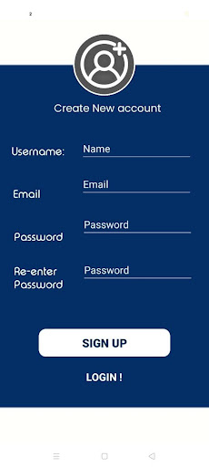
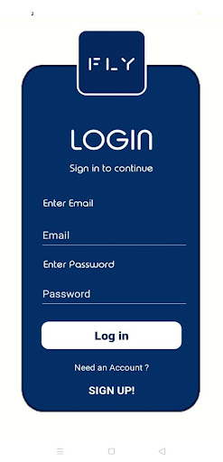
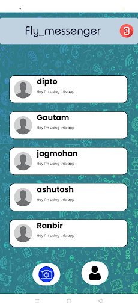
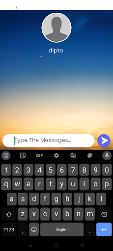
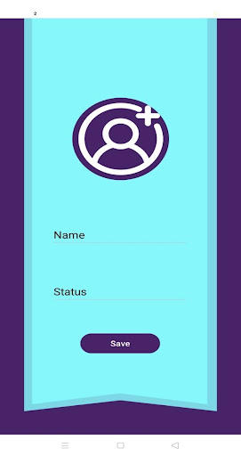

# Fly-messenger

to see main source code 
goto this path
app -> src -> main -> java -> com -> example -> fly-messenger -> activity(screen)

# Screenshots

## 1. Registration Screen, Login Screen
 

## 2. Chat Window Screen, Live Chat Screen
 

## 3. Update Profile Screen

